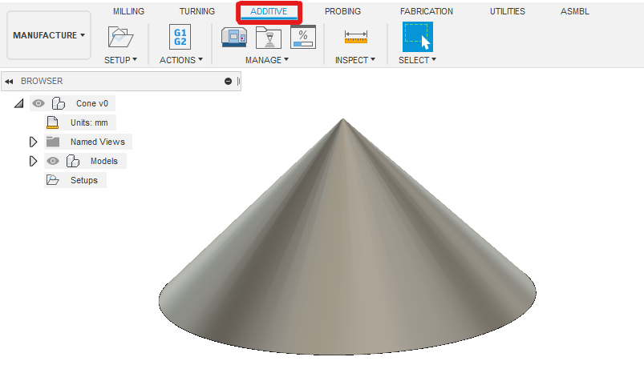

# Overview

This code is designed to create a gcode file suitable for Additive & Subtractive Manufacturing By Layer (ASMBL).

There are 2 main ways this repo can be used.
* As a standalone program that takes 2 input files
  * An additive`.gcode` file from Simplify3D using the `ASMBL.factory` file to get the appropriate settings.
  * A subtractive `.gcode` file from Fusion360.
  * These files require specific setup for this program to work
* As a **Fusion 360 add-in** where the **ENTIRE** workflow from designing the part to getting the merged gcode is in Fusion 360
  * This means no handling dirty STL files!!!

The Fusion 360 add-in is the recommended option however the slicer is new and not widely adopted yet. Therefore, support for Simplify3D is present. The 2 slicers create mostly compatible gcode files. Until further notice, support for both programs will exist.


For the standalone program, download the latest release for the `ASMBL.exe`, an example `config.json`, and the Simplify3D factory file.

# Contents

- [Overview](#overview)
- [Contents](#contents)
- [Installation](#installation)
  - [Fusion 360 Add-in](#fusion-360-add-in)
  - [Fusion360 Design Workspace](#fusion360-design-workspace)
  - [Setting up the code for standalone use (Simplify3D)](#setting-up-the-code-for-standalone-use-simplify3d)
- [Usage](#usage)
  - [Material Choice](#material-choice)
  - [Additive Setup](#additive-setup)
    - [Fusion360](#fusion360)
    - [Standalone (Simplify3D, Other Slicers)](#standalone-simplify3d-other-slicers)
  - [Subtractive Setup](#subtractive-setup)
    - [Stock setup](#stock-setup)
      - [Fusion360](#fusion360-1)
      - [External Slicer](#external-slicer)
    - [CAM setup](#cam-setup)
      - [Tool Config](#tool-config)
      - [2D Contour](#2d-contour)
      - [2D Adaptive](#2d-adaptive)
      - [3D Contour](#3d-contour)
  - [Post Processing](#post-processing)
    - [Fusion Add-in](#fusion-add-in)
    - [Standalone](#standalone)
      - [Config](#config)
      - [Program](#program)
  - [Run Standalone](#run-standalone)
- [Contributions](#contributions)
- [Authors and Acknowledgment](#authors-and-acknowledgment)
- [License](#license)


# Installation


## Fusion 360 Add-in

Install the repo in your desired folder location.

**Windows**
```bash
git clone https://github.com/AndyEveritt/ASMBL.git
cd ASMBL
py -m venv env
source env/Scripts/activate
pip install -r requirements.txt
```

**Important** When setting the virtual environment, the python version must be **64 bit**. Otherwise it will only work as a standalone program but not as a Fusion add-in. Notes on how venv works can be found here https://docs.python.org/3/library/venv.html


To run the standalone program, ensure the python virtual environment is enabled, then use `python main.py`

* Open Fusion360
* Click the add-in tool
* Click the green plus to add an existing add-in


* Navigate to the ASMBL repo location and select the folder


* Select the ASMBL add-in from the list, click `Run on Startup`, then `Run`


## Fusion360 Design Workspace

To make orienting the coordinate axis between modeling, additive, and subtractive workspaces; it is highly recommended to change the `Default modeling orientation` in Fusion360.

This can be done by:
* Going to user preferences
* Changing the `Default modeling orientation` to `Z up`


## Setting up the code for standalone use (Simplify3D)

Download the following files from the releases page:
* `ASMBL.exe`
* `config.json`
* `ASMBL.factory`

Ensure the config and exe are in the same folder for the program to run.

To modify the source code follow the guide here: [Standalone Installation](docs/installation/standalone.md)

# Usage

## Material Choice

A details on materials that have been tested can be found [here](docs/materials.md).

## Additive Setup 

The additive gcode can be setup in various ways.
* Using Fusion360 for the complete workflow (recommended)
* Using Simplify3D (or PrusaSlicer if you want to make a profile) to generate the FFF gcode and Fusion to generate the CAM gcode.

### Fusion360

First you need to create an offset of your model, this will control how much cut-in you have.

* Make a duplicate of the model body(s).
  * Select the body from the Browser menu on the left and `Ctrl+C`, `Ctrl+V`
  * Make sure both bodies perfectly overlaid.
* Offset all the faces on the new body that you wish to machine.
  * Hide the original body to make selecting faces easier.
  * An offset amount of ~0.2-0.3 mm works well in my testing.
  * You do not want to offset any face you will not be able to machine, **ie the base**


* You should have 2 of each body in your part, the exactly modelled part, and the offset part.
* Enter the `Additive` Tab in the `Manufacturing` workspace in Fusion360.
* Create a new setup
  * Click `Select` Machine
  * Import the `E3D - Tool Changer.machine` profile from the `settings` folder of this repo
  * Click `Select` next to `Print Settings`
  * Import the `ASMBL.printsetting` profile from the `settings` folder of this repo
  * Under `Model` select the offset body created earlier




* Optionally rename the setup to `Additive`

### Standalone (Simplify3D, Other Slicers)

Guide on how to create a properly configured gcode file can be generated can be found [here](docs/usage/standalone.md)

## Subtractive Setup

### Stock setup

* Create a new Setup by clicking `Setup` > `New Setup`
* Select `From solid` for the Stock mode
* Click on the part body to select it
  * Select the offset body if created earlier
* Under the `Model` option in the `Setup` tab, select the original part body.

The origin changes depending on if you are using Fusion360 or an external slicer for the additive gcode.

#### Fusion360

* Under `Work Coordinate System` select:
  * Orientation: `Model orientation`
  * Origin: `Model origin`
* The origin should now align with the previously configured FFF setup


#### External Slicer

* Move the origin to the bottom middle of the part
* Orient the Z axis to be vertically upwards

### CAM setup

The CAMing proceedures for ASMBL can be configured with the following processes:

Process | Usage
------- | -----
2D Contour | Used for vertical side walls of parts
2D Adaptive | Used for top surfacing
3D Contour | Used for vertical & close to vertical side walls (including chamfers & filets). May not be able to cut internal features (ie walls with a roof over them)

#### Tool Config

When selecting the tool you must renumber the tool to match the tool number on your printer.

A `Cutting Feedrate` of 500 mm/min works well.


#### 2D Contour

* `Tool`
  * Select/create a cutting tool with appropriate dimensions for what is installed on you ASMBL machine
* `Geometry`
  * Select all the contours for the sides you would like to cut
* `Heights`
  * Set the `Clearance Height`, `Retract Height`, and `Feed Height` equal
    * These must be equal for all processes
  * Set the `Top Height` and `Bottom Height` appropriately for the desired process
    * ie top and bottom of the surface
* `Passes`
  * Set `Sideways Compensation` to `Right (conventional)`
  * Set `Finishing Overlap` to non zero for better finish
  * Enable `Multiple Depths`
  * Set `Maximum Roughing Stepdown` to be equal to ~1-2 layers
    * Ensure this is an integer multiple of the layer height to get the most consistent results
  * Disable `Stock to Leave`
* `Linking`
  * Disable `Ramp`

2D Contour can be used when fine control over the process is needed. Undercuts can be done using this process.


#### 2D Adaptive

* `Tool`
  * Select/create a cutting tool with appropriate dimensions for what is installed on you ASMBL machine
* `Geometry`
  * Select the surface you would like to top surface
* `Heights`
  * Set the `Clearance Height`, `Retract Height`, and `Feed Height` equal
    * These must be equal for all processes
* `Passes`
  * Set `Optimal Load` to ~0.2-0.8 mm
  * Set `Direction` to `Conventional`
  * Disable `Stock to Leave`
* `Linking`
  * Set `Ramp Type` to `Plunge`


Multiple surfaces at different heights can be selected with the same process. This can help reduce setup time in Fusion


#### 3D Contour

* `Tool`
  * Select/create a cutting tool with appropriate dimensions for what is installed on you ASMBL machine
* `Geometry`
  * Select the boundry contours for the sides you would like to cut (everything in the boundry will be cut)
  * You can specify an out and inner boundary to only cut a certain region
* `Heights`
  * Set the `Clearance Height` and `Retract Height` equal
    * These must be equal for all processes
  * Set the `Top Height` and `Bottom Height` appropriately for the desired process
    * ie top and bottom of the surface
* `Passes`
  * Set `Direction` to `Conventional`
  * Set `Maximum Stepdown` to be equal to ~0.5-2 layers
  * Disable `Stock to Leave`
* `Linking`
  * Set `Maximum Stay Down Distance` to `0` mm
  * Set `Ramp Type` to `Profile`


3D Contour can be used for most none flat surfaces that have nothing above them. They are good for quickly CAM'ing a large number of faces.


The machining boundary can be used to restrict which faces are machined. Here the centre sloped surface is diselected but everything within the inner centre hole is machined.


Additional work is required to machine undercuts, however it can be done using 3D Contours. This is beyond the scope of this guide. Overhangs are even more work but again can be done by creating additional offset faces.


>**If any of the above CAM information is wrong or can be improved, please add an issue and I will update the guide**

## Post Processing

### Fusion Add-in

* Click on the `ASMBL` tab along the top navigation bar
* Click `Post Process`
  * If all the toolpaths have not been previously generated or are out of date, you can tick the box to re generate all toolpaths
    * This currently has a bug if the additive toolpath isn't the last to generate where the progress bar will not complete. If this happens just close the progress bar are rerun the post process command
  * Set the remainder of the settings depending on your design by following the tooltips when hovering over them.
  * Click `OK`
* The output gcode will be saved in `~/ASMBL/output/`
  * If the file name already exists, it will be overwritten without warning.
  * The generated file will automatically open in your default `.gcode` editor.
  * **Always preview the gcode fully to check it for mistakes** This is Beta software, there will be bugs.

### Standalone

* Generate and Simulate the full Setup to ensure in looks sensible
* Click `Actions` > `Post Process`
* Select the `asmbl_cam.cps` config from the `post_processors` folder in this repo
* Set the `Output folder` to the desired project location
* Click `Post`

#### Config

The `config.json` contains the parameters that control how the ASMBL parser merges the 2 input files if running the program standalone.

Update the `config.json` so that the following settings are correct for your project:

```json
{
    "InputFiles": {
        "additive_gcode": "path to Simplify3D additive .gcode file",
        "subtractive_gcode": "path to Fusion360 CAM .gcode file"
    },
    "Printer": {
        "bed_centre_x": "mm from origin to bed centre in x axis",
        "bed_centre_y": "mm from origin to bed centre in y axis"
    },
    "PrintSettings": {
        "raft_height": "Height of the top layer of the raft"
    },
    "CamSettings": {
        "layer_overlap": "How many layers the tip of the cutter should be lower than the layers being cut",
        "layer_dropdown": "What number of mm the tip of the cutter should be lowered by"
    },
    "OutputSettings": {
        "filename": "Name of the output file containing the merged gcode script
    }
}
```

#### Program

The program takes the following arguments:

Arg (long) | Arg (short) | Default | Usage
---------- | ----------- | ------- | -----
`--config` | `-C` | `config.json` | Path to the configuration JSON file

## Run Standalone

To run the program, ensure the `config.json` is configured correctly, then run the `ASMBL.exe`

The program will output the file with a name according the the config settings in the `output` folder. (An output folder will be created in the same directory if one does not exist)

>**Always preview the generated gcode in Simplify3D before attempting to print it**

Set the coloring to `Active Toolhead` and enable `Travel moves` to ensure the part is using the correct tools at the correct times.

The subtractive processes are displayed as travel moves, scroll through the layers to check the subtractive processes have been added at the correct point in the print (defined in `config.json`)


# Contributions

Process tbd, open to contributions.

# Authors and Acknowledgment

Author | Contribution
------ | -----------
@AndyEveritt | Code
Greg Holloway | Printer

# License

GPL-3.0