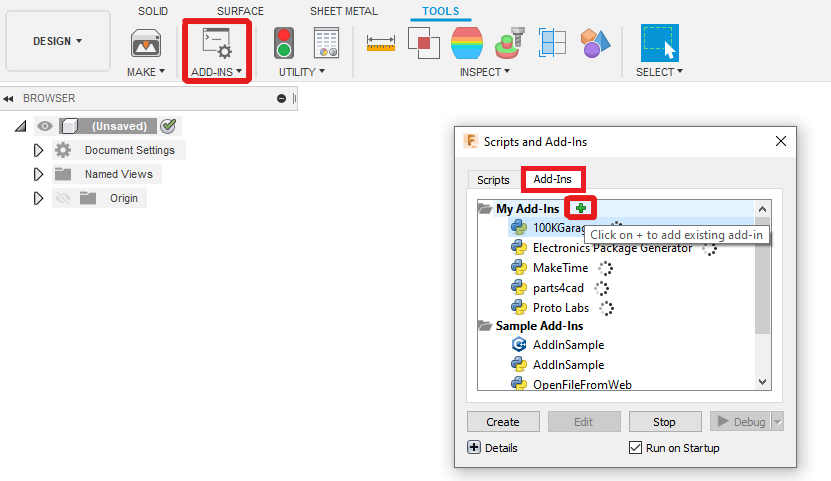

# Overview

This code is designed to create a gcode file suitable for Additive & Subtractive Manufacturing By Layer (ASMBL).

There are 2 main ways this repo can be used.
* As a standalone program that takes 2 input files
  * An additive`.gcode` file from Simplify3D using the `ASMBL.factory` file to get the appropriate settings.
  * A subtractive `.gcode` file from Fusion360.
  * These files require specific setup for this program to work
* As a **Fusion 360 add-in** where the **ENTIRE** workflow from designing the part to getting the merged gcode is in Fusion 360
  * This means no handling dirty STL files!!!

The Fusion 360 add-in is the recommended option however the slicer is new and not widely adopted yet. Therefore, support for Simplify3D is present. The 2 slicers create mostly compatible gcode files. Until further notice, support for both programs will exist.


For the standalone program, download the latest release for the `ASMBL.exe`, an example `config.json`, and the Simplify3D factory file.

<br>
<br>
<br>

# Contents

- [Overview](#overview)
- [Contents](#contents)
- [Installation](#installation)
  - [Fusion 360 Add-in](#fusion-360-add-in)
  - [Fusion360 Design Workspace](#fusion360-design-workspace)
  - [Setting up the code for standalone use (Simplify3D)](#setting-up-the-code-for-standalone-use-simplify3d)
- [Usage](#usage)
  - [Material Choice](#material-choice)
  - [Additive Setup](#additive-setup)
    - [Fusion360](#fusion360)
    - [Standalone (Simplify3D, Other Slicers)](#standalone-simplify3d-other-slicers)
  - [Subtractive Setup](#subtractive-setup)
    - [Stock setup](#stock-setup)
      - [Fusion360](#fusion360-1)
      - [External Slicer](#external-slicer)
    - [CAM setup](#cam-setup)
      - [**Key Understanding Point**](#key-understanding-point)
      - [Tool Config](#tool-config)
      - [Operation Setup](#operation-setup)
  - [Post Processing](#post-processing)
    - [Fusion Add-in](#fusion-add-in)
    - [Standalone](#standalone)
      - [Config](#config)
      - [Program](#program)
  - [Run Standalone](#run-standalone)
- [Contributions](#contributions)
- [Authors and Acknowledgment](#authors-and-acknowledgment)
- [License](#license)

<br>
<br>
<br>

# Installation

## Fusion 360 Add-in

Install the repo in your desired folder location.

**Windows**
```bash
git clone https://github.com/AndyEveritt/ASMBL.git
```

To run the standalone program, ensure the python virtual environment is enabled, then use `python main.py`

* Open Fusion360
* Click the add-in tool
* Click the green plus to add an existing add-in



* Navigate to the ASMBL repo location and select the folder


* Select the ASMBL add-in from the list, click `Run on Startup`, then `Run`


## Fusion360 Design Workspace

To make orienting the coordinate axis between modeling, additive, and subtractive workspaces; it is highly recommended to change the `Default modeling orientation` in Fusion360.

This can be done by:
* Going to user preferences
* Changing the `Default modeling orientation` to `Z up`


## Setting up the code for standalone use (Simplify3D)

Download the following files from the releases page:
* `ASMBL.exe`
* `config.json`
* `ASMBL.factory`

Ensure the config and exe are in the same folder for the program to run.

To modify the source code follow the guide here: [Standalone Installation](docs/installation/standalone.md)

<br>
<br>
<br>

# Usage

## Material Choice

A details on materials that have been tested can be found [here](docs/materials.md).

<br>

## Additive Setup 

The additive gcode can be setup in various ways.
* Using Fusion360 for the complete workflow (recommended)
* Using Simplify3D (or PrusaSlicer if you want to make a profile) to generate the FFF gcode and Fusion to generate the CAM gcode.

> **DO NOT TURN OFF THE RAFT UNLESS YOU KNOW WHAT YOU ARE DOING...IT IS VERY EASY TO CUT INTO THE BED AND BREAK THE TOOL**

### Fusion360

First you need to create an offset of your model, this will control how much cut-in you have.

* Make a duplicate of the model body(s).
  * Select the body from the Browser menu on the left and `Ctrl+C`, `Ctrl+V`
  * Make sure both bodies perfectly overlaid.
* Offset all the faces on the new body that you wish to machine.
  * Hide the original body to make selecting faces easier.
  * An offset amount of ~0.2-0.3 mm works well in my testing.
  * You do not want to offset any face you will not be able to machine, **ie the base**


* You should have 2 of each body in your part, the exactly modelled part, and the offset part.
* Enter the `Additive` Tab in the `Manufacturing` workspace in Fusion360.
* Create a new setup
  * Click `Select` Machine
  * Import the `E3D - Tool Changer.machine` profile from the `settings` folder of this repo
  * Click `Select` next to `Print Settings`
  * Import the `ASMBL.printsetting` profile from the `settings` folder of this repo
  * Under `Model` select the offset body created earlier

Workspace:


Machine:


Setup:


* Optionally rename the setup to `Additive`

### Standalone (Simplify3D, Other Slicers)

Guide on how to create a properly configured gcode file can be generated can be found [here](docs/usage/standalone.md)

<br>

## Subtractive Setup

### Stock setup

* Create a new Setup by clicking `Setup` > `New Setup`
* Select `From solid` for the Stock mode
* Click on the part body to select it
  * Select the offset body if created earlier
* Under the `Model` option in the `Setup` tab, select the original part body.

The origin changes depending on if you are using Fusion360 or an external slicer for the additive gcode.

#### Fusion360

* Under `Work Coordinate System` select:
  * Orientation: `Model orientation`
  * Origin: `Model origin`
* The origin should now align with the previously configured FFF setup


#### External Slicer

* Move the origin to the bottom middle of the part
* Orient the Z axis to be vertically upwards

<br>

### CAM setup

The CAMing proceedures for ASMBL can be configured with the following processes:

Process | Usage
------- | -----
2D Contour | Used for vertical side walls of parts
2D Adaptive | Used for top surfacing
3D Contour | Used for vertical & close to vertical side walls (including chamfers & filets). May not be able to cut internal features (ie walls with a roof over them)

<br>
<br>
<br>

#### **Key Understanding Point**

This program separates each of the CAM operations into segments separated by local maximas in tool height (ie retracts).

> **This is key to understanding how to CAM a model effectively. Below are guidelines but they may not work for every situation.
> Use this overview to understand what to look for when setting up the CAM operations.**

Each of these segments is then classified as either planar or non-planar.

* Planar segments are where the cutting happens on the XY plane.
* Non-planar segments also cut in the Z axis.

The height of each segment is determined:

* For planar segments, it is the minimum height the cutter is active.
* For non-planar segments, it is the maximum height the cutter is active.

All the non-planar segments of an operation are then grouped to maintain their order. The layer height at which the
segment or group of segments needs to occur is calculated.

> The height of a group of non-planar segments is the maximum cutting height of all of the segments in the group.

The segments and groups of segments merged with the additive layers by sorting all additive and subtractive segments by layer height.

> **Because CAM operations are separated into segments by local maximas in tool height, it is vital that the tool retracts between every layer, otherwise the operation will be considered non-planar and it could result in the cutter or tool body colliding with your part.**

Below are examples of a good operation and a bad operation. The only difference is the `linking` settings.

In this operation the tool retracts after every layer. It will be properly segmented and inserted at the correct location.


The same operation with different `linking` settings can result in the following. 2 of the layers do not retract between them, this will cause those layers to be treated as non-planar and due to the geometry of the part, it is likely the tool body will collide with the part during printing.


> **Always inspect the gcode with travel moves turned on after it has been generated. This program reorders a sgnificant proportion of the gcode, it can happen that a single missing/wrong line causes the tool to pass through the model, this is unlikely if sticking with planar operations but a possibility when using non-planar**

<br>
<br>
<br>

#### Tool Config

You can import our tool config by opening the `Tool Library` then right clicking on either the Document, `Cloud`, or `Local` then `Import Tool Library`. The library to import is located in this repo in `settings`/`ASMBL.tools`


When selecting the tool you must renumber the tool to match the tool number on your printer.

A `Cutting Feedrate` of 500 mm/min works well.


#### Operation Setup

The CAM operations can be created using these buttons in the `Milling` Toolbar


Full setup details for operations can be found here: [CAM Operation Setup](docs/usage/cam_operations.md)

## Post Processing

### Fusion Add-in

* Regenerate the additive setup
* Regenerate the subtractive setup
  *  This offsets the CAM operation Z height equal to the raft height.
* Click on the `ASMBL` tab along the top navigation bar
* Click `Post Process`
  * If all the toolpaths have not been previously generated or are out of date, you can tick the box to re generate all toolpaths
    * This currently has a bug if the additive toolpath isn't the last to generate where the progress bar will not complete. If this happens just close the progress bar are rerun the post process command
  * The default settings are auto filled.
    * Layer overlap is an important setting
      * An overlap > 0 will use the side of the cutter instead of the tip, this can give a better finish to walls. If there are no overhangs, recommended to use `2`.
      * However this can cause issues if machining overhangs, in which case set the overlap to 0
    * Layer Dropdown can also affect finish
      * This will lower the z height of all the CAM operations by this value, it can be used to make the cutter tip locate in the middle of a layer instead of between 2 layers which can give a better finish; but if you want Z accuracy, leave it at 0.
  * Click `OK`
* The output gcode will be saved in `~/ASMBL/output/`
  * If the file name already exists, it will be overwritten without warning.
  * The generated file will automatically open in your default `.gcode` editor.
  * **Always preview the gcode fully to check it for mistakes** This is Beta software, there will be bugs.

### Standalone

* Generate and Simulate the full Setup to ensure in looks sensible
* Click `Actions` > `Post Process`
* Select the `asmbl_cam.cps` config from the `post_processors` folder in this repo
* Set the `Output folder` to the desired project location
* Click `Post`

#### Config

The `config.json` contains the parameters that control how the ASMBL parser merges the 2 input files if running the program standalone.

Update the `config.json` so that the following settings are correct for your project:

```json
{
    "InputFiles": {
        "additive_gcode": "path to Simplify3D additive .gcode file",
        "subtractive_gcode": "path to Fusion360 CAM .gcode file"
    },
    "Printer": {
        "bed_centre_x": "mm from origin to bed centre in x axis (150)",
        "bed_centre_y": "mm from origin to bed centre in y axis (100)"
    },
    "PrintSettings": {
        "raft_height": "Height of the top layer of the raft (2.133)"
    },
    "CamSettings": {
        "layer_overlap": "How many layers the tip of the cutter should be lower than the layers being cut",
        "layer_dropdown": "What number of mm the tip of the cutter should be lowered by"
    },
    "OutputSettings": {
        "filename": "Name of the output file containing the merged gcode script
    }
}
```

#### Program

The program takes the following arguments:

Arg (long) | Arg (short) | Default | Usage
---------- | ----------- | ------- | -----
`--config` | `-C` | `config.json` | Path to the configuration JSON file

## Run Standalone

To run the program, ensure the `config.json` is configured correctly, then run the `ASMBL.exe`

The program will output the file with a name according the the config settings in the `output` folder. (An output folder will be created in the same directory if one does not exist)

>**Always preview the generated gcode in Simplify3D before attempting to print it**

Set the coloring to `Active Toolhead` and enable `Travel moves` to ensure the part is using the correct tools at the correct times.

The subtractive processes are displayed as travel moves, scroll through the layers to check the subtractive processes have been added at the correct point in the print (defined in `config.json`)


# Contributions

Process tbd, open to contributions.

# Authors and Acknowledgment

Author | Contribution
------ | -----------
@AndyEveritt | Code
Greg Holloway | Printer

# License

GPL-3.0
