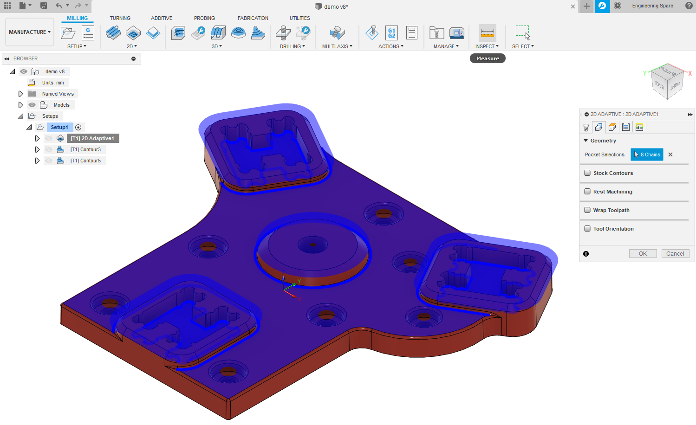
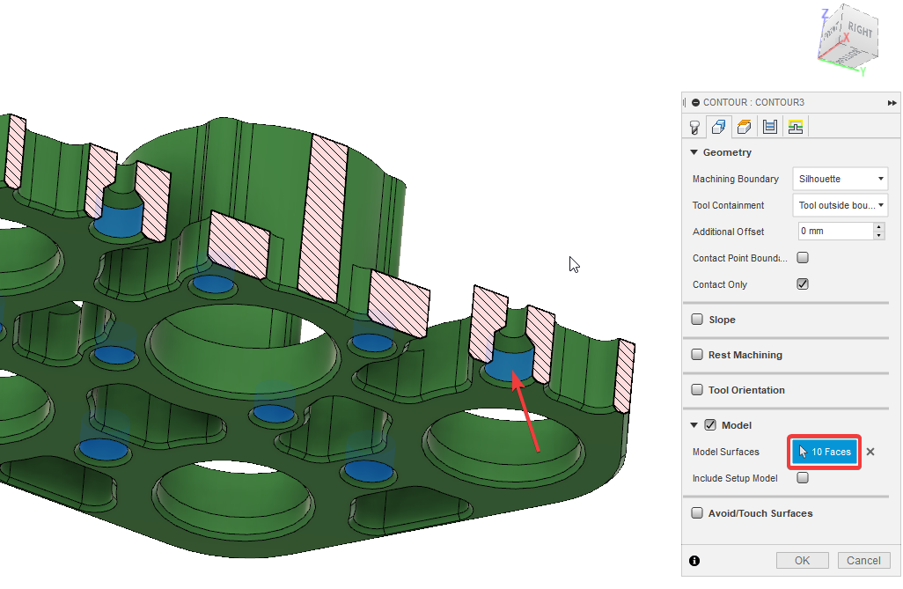
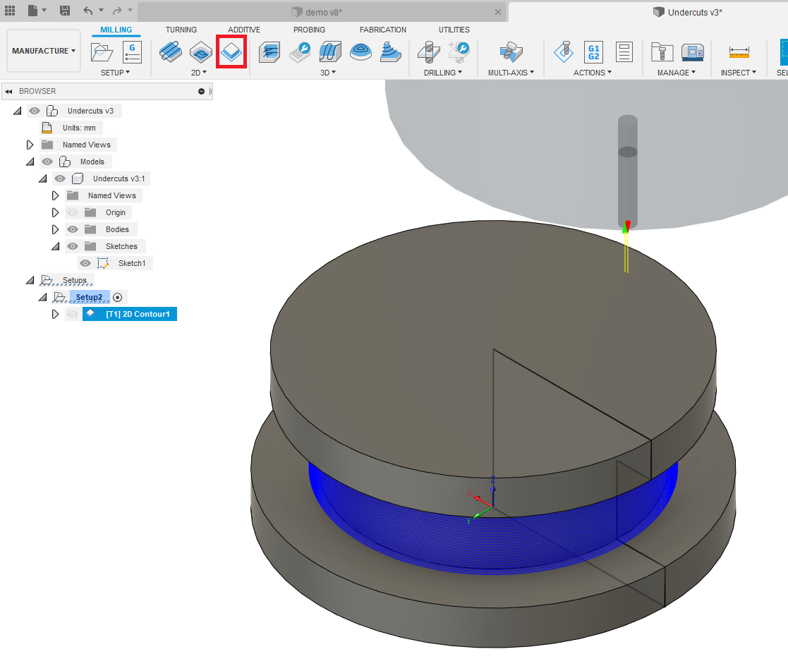
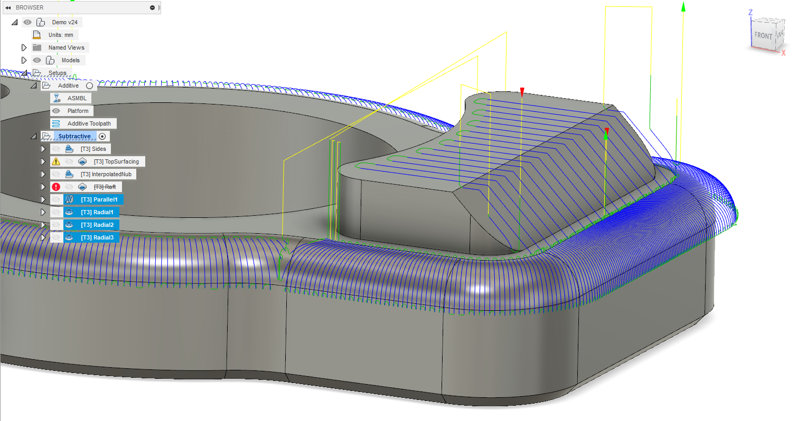

[Back - README](../../README.md)

# Planar

The follow page details the settings to set for the main operation types used for ASMBL. Most models can be setup using a single `3D Contour` and `2D Adaptive Clearing`. Feature specific CAM operations (such as smoothing a fillet) can be done with additional operations if the model requires it.

This is a guide that I have found to work in most situations, it may not always be correct.

## 2D Adaptive Clearing

> **Uses**: Top surfacing

* `Tool`
  * Select/create a cutting tool with appropriate dimensions for what is installed on you ASMBL machine
* `Geometry`
  * Select the surface you would like to top surface
* `Heights`
  * Set the `Clearance Height` and `Retract Height` equal height
    * Exact height doesn't matter, just ensure the tool will clear the print.
* `Passes`
  * Set `Optimal Load` to ~0.2-0.8 mm
  * Set `Direction` to `Conventional`
  * Disable `Stock to Leave`
* `Linking`
  * Set `Ramp Type` to `Plunge`

Multiple surfaces at different heights can be selected with the same process. This can help reduce setup time in Fusion

## 3D Contour

> **Uses**: Side walls & slopes

3D Contour can be used for most none flat surfaces. They are good for quickly CAM'ing a large number of faces.

* `Tool`
  * Select/create a cutting tool with appropriate dimensions for what is installed on you ASMBL machine
* `Geometry`
  * Recommended settings to machine everything:
    * Set `Machining Boundary` to `Silhouette`
    * Set `Tool Containment` to `Tool outside boundary`
  * If you want to do more complicated CAM operations you might want to select the boundry contours for the sides you would like to cut (everything in the boundry will be cut)
    * You can specify an out and inner boundary to only cut a certain region
    * Play with the settings here to make it do what you want
* `Heights`
  * Set the `Clearance Height` and `Retract Height` the same height
    * Exact height doesn't matter, just ensure the tool will clear the print.
  * The `Top Height` and `Bottom Height` can normally be left but you may want to change them for your part:
    * ie if you have a chamfer on the bottom face; you can set the the bottom height to the top edge of the chamfer
* `Passes`
  * Set `Direction` to `Conventional`
  * Set `Maximum Stepdown` to be equal to ~2 layers
    * Recommend large stepdown for vertical faces and a small stepdown if you want to interpolate a slope to reduce staircase effect.
  * Set `Order By Depth` to `True`
  * Disable `Stock to Leave`
* `Linking`
  * Set `Maximum Stay Down Distance` to `0` mm
  * Set `Ramp Type` to `Plunge`
  * Set `Transition Type` to `No contact`

If a face has something above it, then it can be CAM'd by selecting that face as below (You may need to create a separate operation for this to work):

Angled overhangs can be CAM'd using offset faces. See the example [here](../../examples/Case.f3d) for how that can be setup.

## 2D Contour

> **Uses**: Can be used for vertical walls where you may want more control that with a 3D contour

* `Tool`
  * Select/create a cutting tool with appropriate dimensions for what is installed on you ASMBL machine
* `Geometry`
  * Select all the contours for the sides you would like to cut
* `Heights`
  * Set the `Clearance Height`, `Retract Height`, and `Feed Height` equal height
    * Exact height doesn't matter, just ensure the tool will clear the print.
  * Set the `Top Height` and `Bottom Height` appropriately for the desired process
    * ie top and bottom of the surface
* `Passes`
  * Set `Sideways Compensation` to `Right (conventional)`
  * Set `Finishing Overlap` to non zero for better finish
  * Enable `Multiple Depths`
  * Set `Maximum Roughing Stepdown` to be equal to ~1-2 layers
    * Ensure this is an integer multiple of the layer height to get the most consistent results
  * Disable `Stock to Leave`
* `Linking`
  * Disable `Ramp`

2D Contour can be used when fine control over the process is needed. Undercuts can be done using this process.

# Non-planar Operations

To make an operation be considered as Non-planar, simply rename the operation in the subtractive setup so the name begins
with `NP_`

Non-planar operations can be configured similarly to the planar operations described above. More care is required when creating the toolpaths as is it easy to accidentally cut into the part.

Some non-planar operations that have been tested to work are:

* Parallel
* Radial
* Spiral
* Scallop

An example Fusion setup can be found [here](../../examples/Spinner_Demo.f3d)

